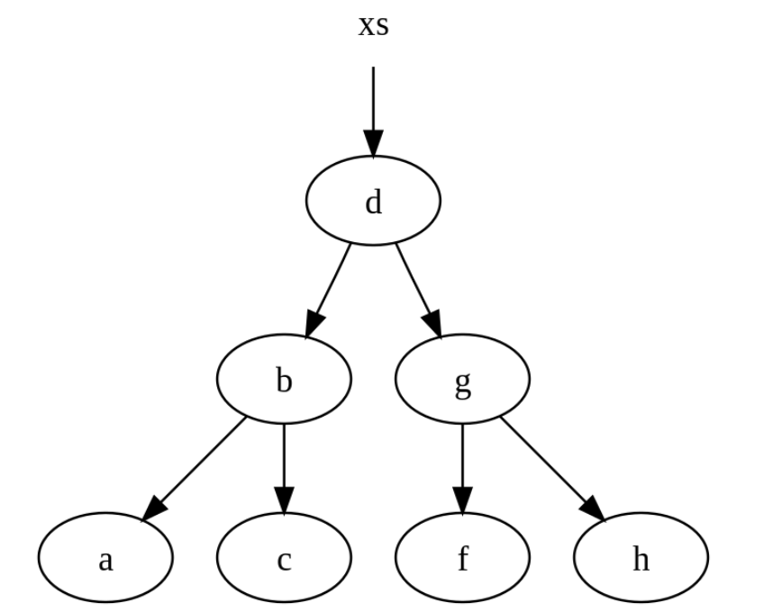
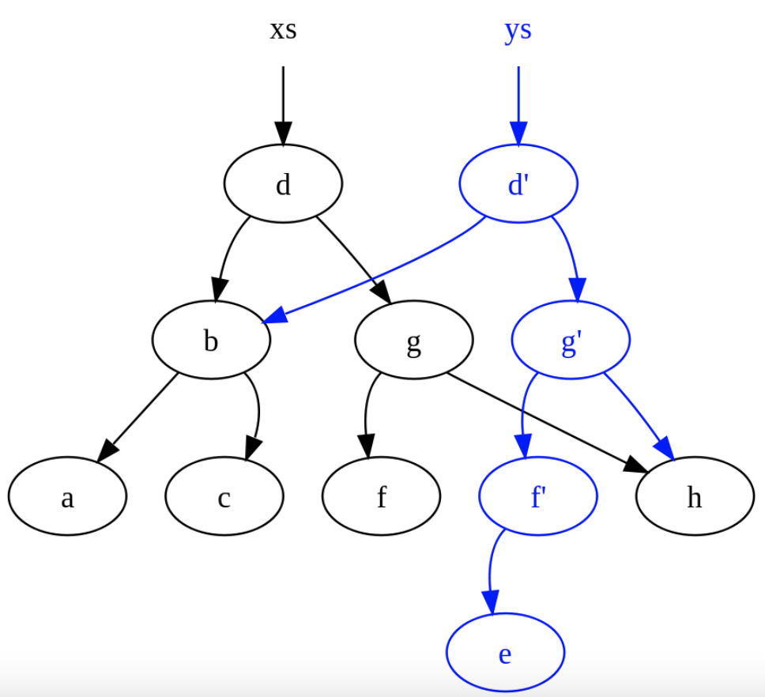

# Persistent Data Structures

####  persistent data structure is a data structure capable of preserving the current version of itself when modified. In essence, a persistent data structure is immutable. 持久性数据结构是指在修改时能够保留当前版本的数据结构。从本质上讲，持久性数据结构是不可改变的。

## Persistent Singly Linked Lists

### Normal single-linked


We will insert the new node at the fourth position in the list. First, we traverse遍历 the list until we've reached到达 that position. Then the node that will precede the new node is unlinked from the next node and relinked to the new node. The new node is, in turn, linked to the remaining nodes in the list:

### Persistent Singly Linked Lists


To insert a new node at the fourth position, we traverse the list as before only copying each node along the way. Each copied node is linked to the next copied node

The last copied node is linked to the new node, and the new node is linked to the remaining剩余 nodes in the old list:

## Persistent Binary Trees

Consider a binary trees where 



```
xs = [a, b, c, d, f, g, h]
```


```c
 fun insert (x, E) = T (E, x, E)
   | insert (x, s as T (a, y, b)) =
        if x < y then T (insert (x, a), y, b)
        else if x > y then T (a, y, insert (x, b))
        else s
 //After executing        
 ys = insert ("e", xs)
```



