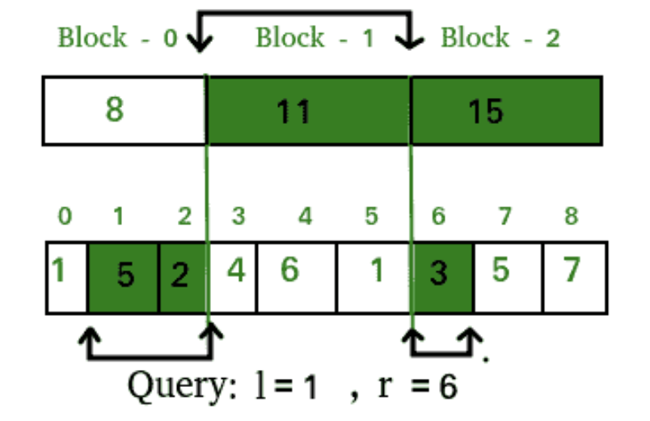

# Sqrt Decomposition

#### problem：Given an array a[0…n−1], implement a data structure that allows to find the sum of the elements a[l…r] for arbitrary任意 l and r in O(√n) operations.

The basic idea of sqrt decomposition is preprocessing

我们将数组 a 分解为大约 √n 的块，对于每个块 i，我们将预先计算它的元素之和 b [ i ] 

We'll divide the array a into blocks of length approximately √n, and for each block i we'll precalculate the sum of elements in it b[i]

```c
// input data
int n;
vector<int> a (n);
// preprocessing
int len = (int) sqrt (n + .0) + 1; // size of the block and the number of blocks
vector<int> b (len);
for (int i=0; i<n; ++i)
    b[i / len] += a[i];
```


So, we have calculated the values of b[k] (this required O(n) operations). How can they help us to answer each query [l,r][l,r] ? 

所以，我们已经计算出了b[k]的值（这需要O(n)次操作）。它们如何帮助我们回答每个查询l,r ? 

 Notice that if the interval [l,r][l,r] is long enough, it will contain several whole blocks, and for those blocks we can find the sum of elements in them in a single operation. As a result, the interval [l,r][l,r] will contain parts of only two blocks, and we'll have to calculate the sum of elements in these parts trivially.请注意，如果区间l,r足够长，它将包含几个完整的区块，对于这些区块，我们可以在一次操作中找到其中元素的和。因此，区间l,r将只包含两个区块的部分，我们必须琐碎地计算这些部分的元素之和。



Thus, in order to calculate the sum of elements on the interval [l,r][l,r] we only need to sum the elements of the two "tails": [l…(k+1)⋅s−1] and [p⋅s…r], and sum the values b[i] in all the blocks from k+1 to p−1:


```c
// answering the queries
for (;;) {
    int l, r;
  // read input data for the next query
    int sum = 0;
    for (int i=l; i<=r; )
        if (i % len == 0 && i + len - 1 <= r) {
            // if the whole block starting at i belongs to [l, r]
            sum += b[i / len];
            i += len;
        }
        else {
            sum += a[i];
            ++i;
        }
}

```

```c
int sum = 0;
int c_l = l / len,   c_r = r / len;
if (c_l == c_r)
    for (int i=l; i<=r; ++i)
        sum += a[i];
else {
    for (int i=l, end=(c_l+1)*len-1; i<=end; ++i)
        sum += a[i];
    for (int i=c_l+1; i<=c_r-1; ++i)
        sum += b[i];
    for (int i=c_r*len; i<=r; ++i)
        sum += a[i];
}
```

This implementation has unreasonably many division operations (which are much slower than other arithmetical operations). Instead, we can calculate the indices of the blocks cl and crcr which contain indices l and r, and loop through blocks cl+1…cr−1 with separate processing of the "tails" in blocks cl and cr. This approach corresponds to the last formula in the description, and makes the case cl=cr a special case.

## Mo's algorithm

#### problem：when each queries asks to find the **mode** of its range (the number that appears the most often). For this each block would have to store the count of each number in it in some sort of data structure, and we cannot longer perform the merge step fast enough any more. 

The idea is to answer the queries in a special order based on the indices. We will first answer all queries which have the left index in block 0, then answer all queries which have left index in block 1 and so on. And also we will have to answer the queries of a block is a special order, namely sorted by the right index of the queries.

其思想是以基于索引的特殊顺序回答查询。我们将首先回答在块0中有左索引的所有查询，然后回答在块1中有左索引的所有查询，以此类推。而且我们还要回答一个块的查询是一个特殊的顺序，即按查询的正确索引排序。

As already said we will use a single data structure. This data structure will store information about the range. At the beginning this range will be empty. When we want to answer the next query (in the special order), we simply extend or reduce the range, by adding/removing elements on both sides of the current range, until we transformed it into the query range. This way, we only need to add or remove a single element once at a time, which should be pretty easy operations in our data structure.

如前所述，我们将使用单一的数据结构。这个数据结构将存储有关范围的信息。开始的时候，这个范围是空的。当我们想要回答下一个查询(以特殊顺序)时，我们只需通过在当前范围的两侧添加/删除元素来扩展或缩小范围，直到将其转换为查询范围。这样，我们一次只需要添加或删除一个元素，这在我们的数据结构中应该是相当容易的操作。

Since we change the order of answering the queries, this is only possible when we are allowed to answer the queries in offline mode.

因为我们改变了回答查询的顺序，所以这只有在允许我们在离线模式下回答查询时才是可能的。

```c
void remove(idx);  // TODO: remove value at idx from data structure
void add(idx);     // TODO: add value at idx from data structure
int get_answer();  // TODO: extract the current answer of the data structure

int block_size;

struct Query {
    int l, r, idx;
    bool operator<(Query other) const
    {
        return make_pair(l / block_size, r) <
               make_pair(other.l / block_size, other.r);
    }
};

vector<int> mo_s_algorithm(vector<Query> queries) {
    vector<int> answers(queries.size());
    sort(queries.begin(), queries.end());

    // TODO: initialize data structure

    int cur_l = 0;
    int cur_r = -1;
    // invariant: data structure will always reflect the range [cur_l, cur_r]
    for (Query q : queries) {
        while (cur_l > q.l) {
            cur_l--;
            add(cur_l);
        }
        while (cur_r < q.r) {
            cur_r++;
            add(cur_r);
        }
        while (cur_l < q.l) {
            remove(cur_l);
            cur_l++;
        }
        while (cur_r > q.r) {
            remove(cur_r);
            cur_r--;
        }
        answers[q.idx] = get_answer();
    }
    return answers;
}
```

