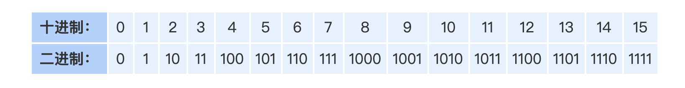

# 子掩码枚举(Bitmask Enumeration)

## 8 all submasks of a given mask（枚举所有子掩码来自给定的掩码)


```c
int s = m;

while (s > 0) {
  .. you can use s ...
  s = (s-1) & m;

 }


/*or*/
  
  
for (int s=m; s; s=(s-1)&m){
   if (s==0)  break; 
  ... you can use s ...
}
```




### question  :

given a bitmask m ,want to efficiently iterate all of submasks

suppose we have a current bitmasks

we want to move on to the next bitmask

by subtracting from the masks one unit

### method

Suppose we have a current bitmask s, and we want to move on to the next bitmask. By subtracting from the mask s one unit, we will remove the rightmost set bit and all bits to the right of it will become 1. Then we remove all the "extra" one bits that are not included in the mask m and therefore can't be a part of a submask. We do this removal by using the bitwise operation `(s-1) & m`. As a result, we "cut" mask s−1 to determine the highest value that it can take, that is, the next submask after s in descending order.

假设我们有一个当前的位掩码s，我们想进入下一个位掩码。通过从掩码s中减去一个单位，我们将去掉最右边的集合位，它右边的所有位将变成1。然后我们删除所有 "额外的 "一比特，这些比特不包括在掩码m中，因此不能成为子掩码的一部分。我们通过使用位运算`(s-1)&m`来进行这种去除。结果，我们 "切割 "掩码s-1，以确定它能取的最高值，也就是s之后的下一个子掩码，按降序排列。

#### Example 

```c
#include <stdio.h>

int main(){
int m = 0b101;
int s = m;
printf("s-1=%d s=%d \n",(s-1),s);
for (int s=m; ; s=(s-1)&m) {
 printf("s-1=%d s=%d \n",(s-1),s);
 if (s==0)  break;
}
return s;
}
int main();

//s-1=4 s=5 
//s-1=3 s=4 
//s-1=0 s=1 
//s-1=-1 s=0 

```


## LeetCode 例子

words = ["aaaa",'asas','able','ability','actt','acto','access']
puzzles = ['aboveyz','abrodyz','abslute','absoryz','actresz','gaswxyz']

寻找words 与 puzzles中相同的子母

```python
#Explanation:
#1 valid word for "aboveyz" : "aaaa" 
#1 valid word for "abrodyz" : "aaaa"
#3 valid words for "abslute" : "aaaa", "asas", "able"
#2 valid words for "absoryz" : "aaaa", "asas"
#4 valid words for "actresz" : "aaaa", "asas", "actt", "access"
#There're no valid words for "gaswxyz" cause none of the words in the list contains letter 'g'.


from functools import reduce
import collections
words = ["aaaa",'asas','able','ability','actt','acto','access']
puzzles = ['aboveyz','abrodyz','abslute','absoryz','actresz','gaswxyz']

def findNumOfValidWords(words, puzzles) :
    scores = collections.Counter(reduce(lambda s, c: s | 1 << (ord(c) - ord('a')), w, 0) for w in words)
    ans = []
    for p in puzzles:
        score = 0
        required_bit = 1 << (ord(p[0]) - ord('a'))

        mask = submask = reduce(lambda s, c: s | 1 << (ord(c) - ord('a')), p, 0)

        # enumerate all masks in descending order without repetion
        while submask:
            if submask & required_bit:
                score += scores[submask]
            submask = (submask - 1) & mask
            print(submask)
        ans.append(score)
    return ans
print(findNumOfValidWords(words,puzzles))
```

```c++
class Solution {
public:
    vector<int> findNumOfValidWords(vector<string>& words, vector<string>& puzzles) {
        unordered_map<int,int> mp;
        for(auto w:words){
            int mask=0;
            for(auto a:w){
                mask|=(1<<(a-'a'));
            }
            mp[mask]++;
        }
        vector<int> ans;
        for(auto p:puzzles){
            int su=0;
            for(auto a:p){
                su|=(1<<(a-'a'));
            }
            int mas=su;
            int first=(1<<(p[0]-'a'));
            int co=0;
            while(1){
                if(((su & first)==first) && mp.find(su)!=mp.end()){
                    co+=mp[su];
                }
                if(su==0){
                    break;
                }
                su=(su-1)&mas;
            }
            ans.push_back(co);
        }
        return ans;
    }
};
```

