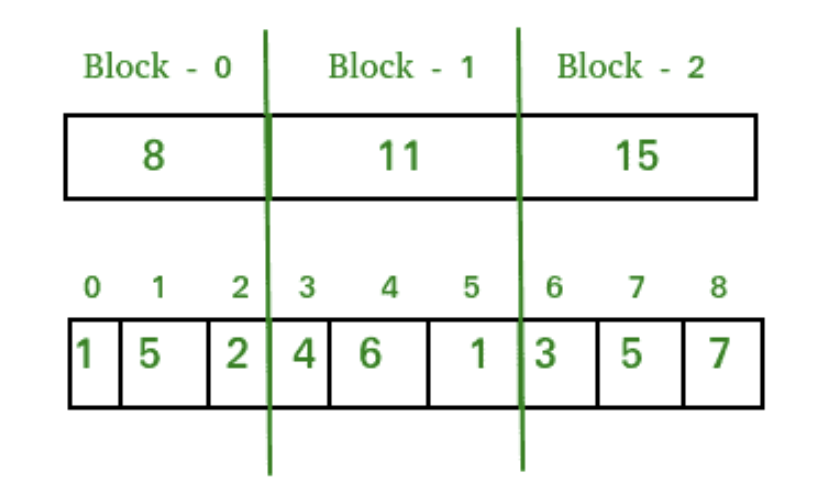

# Sqrt Decomposition

## 目的

Square root decomposition is used to solve range queries efficiently. It enables you to answer questions like “What is the smallest element between indexes L to R in an array?” or “What is the GCD of all elements between index L to R in an array?”

The manner in which this is done, is by some preprocessing.

## 原理

让我们考虑一下，我们有 9 个元素组成的数组。

```
A [] = {1, 5, 2, 4, 6, 1, 3, 5, 7}
```

让我们将此数组分解为`sqrt(9)`块，其中每个块将包含其中的元素总和。 因此，现在我们的分解数组将如下所示：



到目前为止，我们已经构造了分解后的`sqrt(9)`块数组，现在我们需要打印给定范围内的元素总数。 因此，首先让我们看一下范围查询可以在数组上出现的两种基本重叠类型：

**类型 1 的范围查询（给定范围位于块边界上）**：


在这种类型的查询中，范围可能完全覆盖连续的`sqrt`块。 因此，我们可以轻松地将此范围内的值之和回答为完全重叠的块之和。
因此，上述图像中上述查询的答案将是：`ans = 11 + 15 = 26`
**时间复杂度**：在最坏的情况下，我们的范围可以是 0 至`n-1`（其中`n`是数组的大小，并假设`n`是一个完美的正方形）。 在这种情况下，我们的查询范围将所有块完全重叠。 因此，要回答此查询，我们需要遍历该数组的所有分解块，并且知道块数`= sqrt(n)`。 因此，在最坏的情况下，此类查询的复杂度将为`O(sqrt(n))`。

**类型 2 的范围查询（鉴于范围不在边界上）**


我们可以通过对位于查询范围内的完全重叠的分解块中的数据求和，然后对来自原始数组的元素进行逐一求和，而原始数组的原始块的相应块未与查询范围完全重叠，则可以处理此类查询。
因此，上述图像中上述查询的答案将是：`ans = 5 + 2 + 11 + 3 = 21`
**时间复杂度**：让我们考虑一个查询`[l = 1, r = n-2]`（`n`是数组的大小，并具有从 0 开始的索引）。 因此，对于该查询，正好`sqrt(n) – 2`块将完全重叠，其中第一个和最后一个块将部分重叠，而重叠范围之外仅剩一个元素。 因此，完全重叠的块可以在`(sqrt(n) – 2) ~ sqrt(n)`迭代中求和，而第一个块和最后一个块需要分别遍历。 但是我们知道每个块中的元素数量为最大`sqrt(n)`，所以要单独求和最后一个块，我们需要进行`(sqrt(n) - 1) ~ sqrt(n)`个迭代。
因此，总体复杂度`= O(sqrt(n))+ O(sqrt(n))+ O(sqrt(n))= O(3 * sqrt(N))= **O(sqrt(n))`

**更新查询（点更新）**：

在此查询中，我们仅查找给定索引所在的块，然后减去其先前的值并根据点更新查询添加新的更新值。
**时间复杂度**：`O(1)`

## C++ 实现

```c
// C++ program to demonstrate working of Square Root 
// Decomposition. 
#include "iostream" 
#include "math.h" 
using namespace std; 

#define MAXN 10000 
#define SQRSIZE  100 

int arr[MAXN];               // original array 
int block[SQRSIZE];          // decomposed array 
int blk_sz;                      // block size 

// Time Complexity : O(1) 
void update(int idx, int val) 
{ 
    int blockNumber = idx / blk_sz; 
    block[blockNumber] += val - arr[idx]; 
    arr[idx] = val; 
} 

// Time Complexity : O(sqrt(n)) 
int query(int l, int r) 
{ 
    int sum = 0; 
    while (l<r and l%blk_sz!=0 and l!=0) 
    { 
        // traversing first block in range 
        sum += arr[l]; 
        l++; 
    } 
    while (l+blk_sz <= r) 
    { 
        // traversing completely overlapped blocks in range 
        sum += block[l/blk_sz]; 
        l += blk_sz; 
    } 
    while (l<=r) 
    { 
        // traversing last block in range 
        sum += arr[l]; 
        l++; 
    } 
    return sum; 
} 

// Fills values in input[] 
void preprocess(int input[], int n) 
{ 
    // initiating block pointer 
    int blk_idx = -1; 

    // calculating size of block 
    blk_sz = sqrt(n); 

    // building the decomposed array 
    for (int i=0; i<n; i++) 
    { 
        arr[i] = input[i]; 
        if (i%blk_sz == 0) 
        { 
            // entering next block 
            // incementing block pointer 
            blk_idx++; 
        } 
        block[blk_idx] += arr[i]; 
    } 
} 

// Driver code 
int main() 
{ 
    // We have used separate array for input because 
    // the purpose of this code is to explain SQRT 
    // decomposition in competitive programming where 
    // we have multiple inputs. 
    int input[] = {1, 5, 2, 4, 6, 1, 3, 5, 7, 10}; 
    int n = sizeof(input)/sizeof(input[0]); 

    preprocess(input, n); 

    cout << "query(3,8) : " << query(3, 8) << endl; 
    cout << "query(1,6) : " << query(1, 6) << endl; 
    update(8, 0); 
    cout << "query(8,8) : " << query(8, 8) << endl; 
    return 0; 
} 
```

## python 实现查询

```python
left_bucket_idx = L/sqrt(N)

# update the first part
for j in range(L, sqrt(N)*left_bucket_idx):
	A[j] += X

right_bucket_idx = R/sqrt(N)

# update the second part
for j in range(left_bucket_idx, right_bucket_idx+1):
	bucket[j] += X

# update the third part
for j in range(right_bucket_idx*sqrt(N), R):
	A[j] += X

```

